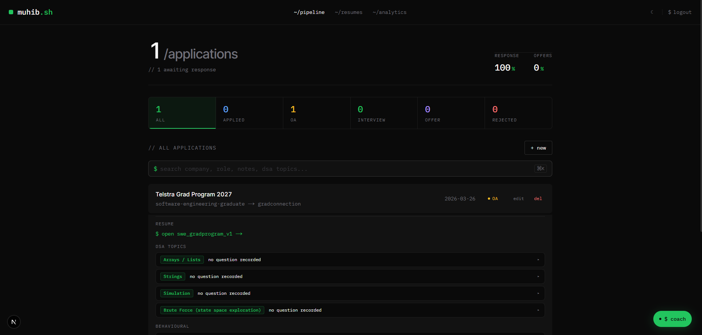
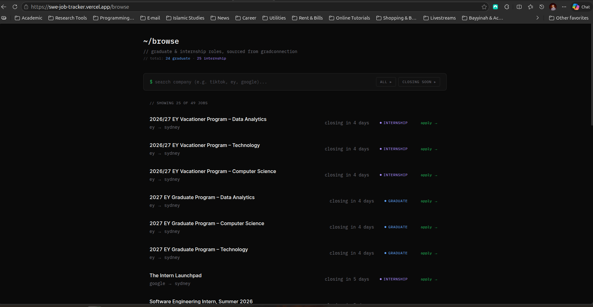
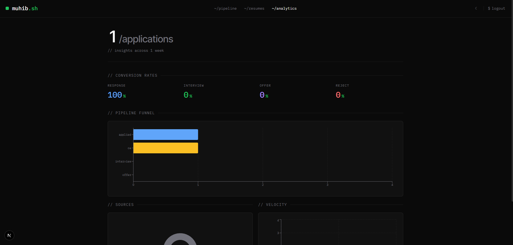
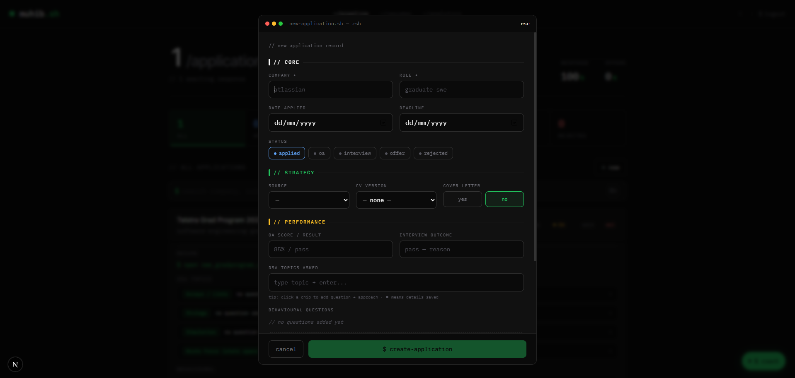
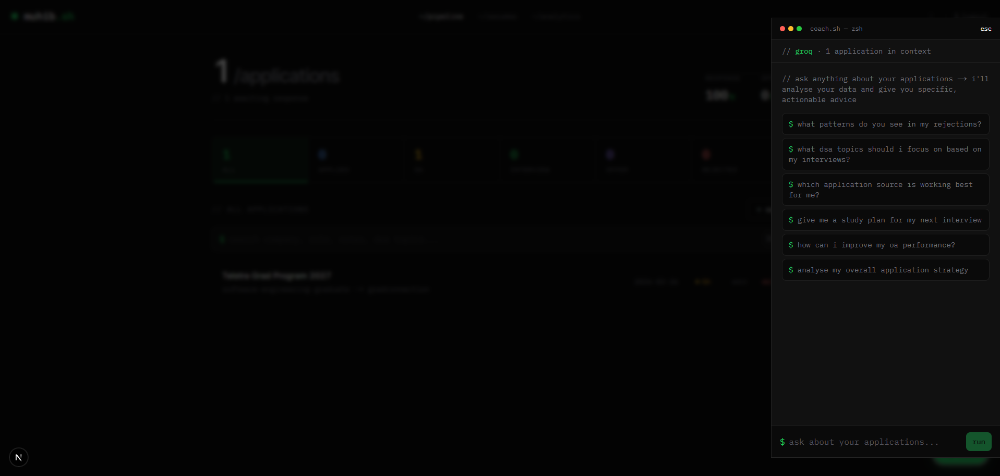
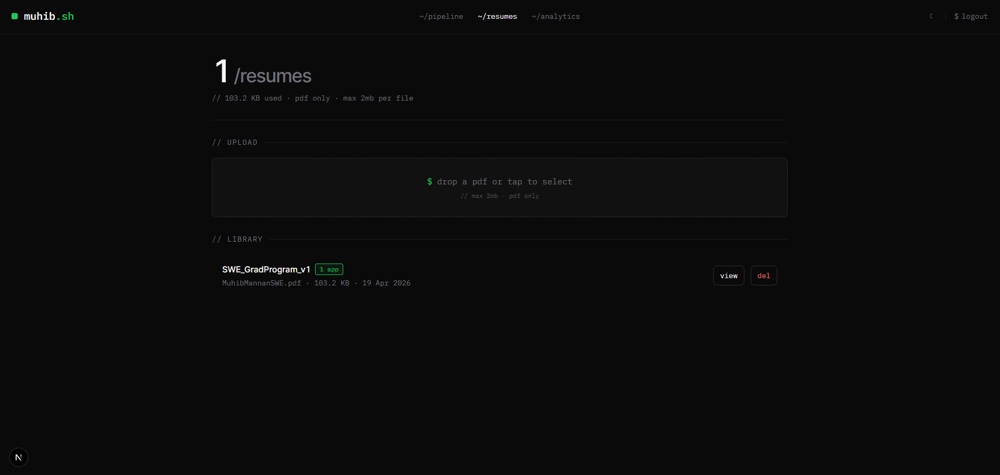
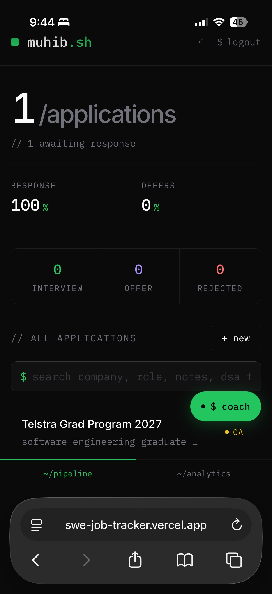
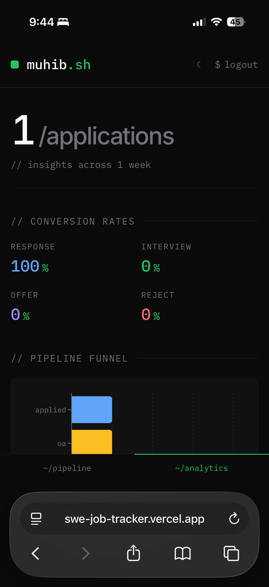
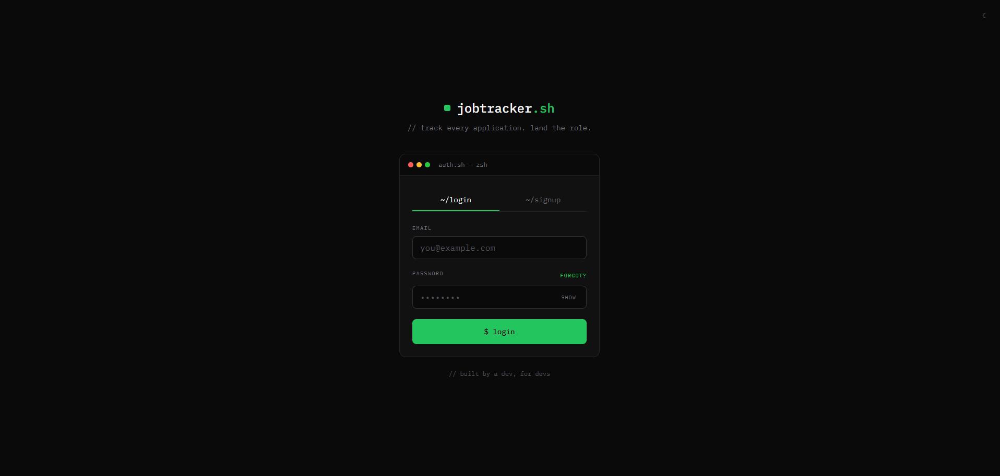

<div align="center">

# jobtracker.sh

**A terminal-aesthetic job application tracker for software engineering graduates.**

Track every application through the hiring pipeline, upload multiple CV versions, log interview performance, and get AI-powered coaching to improve over time.

[**Live demo →**](https://swe-job-tracker.vercel.app)


</div>

---

## Why I built this

I'm actively applying to SWE graduate roles. Spreadsheets were fine at first, but I kept losing track of which CV version I sent, which DSA questions came up in each OA, and what I'd promised to improve after each rejection. I wanted a single place to log everything and — more importantly — spot patterns in my own data.

So I built jobtracker.sh: a dev-tool-flavoured tracker with a pipeline view, full performance logging, a resume library, and an AI coach that reads my data and gives specific advice.

---

## Screenshots

### Pipeline (desktop)

The main dashboard — hero stats, pipeline filter tabs, search bar with `⌘K` shortcut, and an expanded application card showing the linked resume, DSA topics, and behavioural Q&A.



### Browse jobs (desktop)

A live feed of Sydney SWE graduate roles and internships, sourced from GradConnection by my [job-scraper](https://github.com/muhibmannan/job-scraper) service every 30 minutes. Sortable by closing date, filterable by category and company, with each row linking out to the original listing.

The data lives in Supabase Postgres, exposed via a FastAPI service deployed on Fly.io, and rendered here as a server-side Next.js page with `revalidate: 300` so it stays fresh without hammering the backend.



### Analytics

Conversion rates, pipeline funnel, source breakdown, and weekly application velocity.



### Application modal

Rich logging for every application — core details, strategy, performance notes, DSA topics asked, behavioural questions with full STAR-style answers, and post-mortem reflection.



### AI Coach

Ask questions about your own application data and get pattern-level insights powered by Groq's Llama 3.3 70B — fast enough to feel instant.



### Resume library

Upload multiple CV versions (v1, tailored-for-fintech, etc.), link them to specific applications, and see which CVs are actively in use via usage badges.



### Mobile

Fully responsive with a bottom tab bar for quick nav between pipeline, resumes, and analytics.

<p align="center">
  
  
</p>

### Authentication

Terminal-style login with password show/hide, strength meter on reset, and proper iOS autofill handling.



---

## Features

### Pipeline tracking

- Full CRUD for applications with status progression: `applied → OA → interview → offer / rejected`
- Pipeline filter tabs with live counts per stage
- Full-text search across company, role, notes, DSA topics, and behavioural Q&A
- Keyboard shortcut (`⌘K` / `Ctrl+K`) to focus search from anywhere

### Performance logging

- Per-application OA scores and interview outcomes
- DSA topics asked, with optional question text and approach notes
- Behavioural questions with full STAR-format answers
- Post-interview reflection fields (mistakes made, what to improve)

### Resume library

- Upload multiple CV versions, label each one
- Link specific CVs to applications via dropdown
- Usage badges showing how many applications use each CV
- One-tap view opens the PDF via short-lived signed URLs (60s expiry)

### AI career coach

- Ask questions about your own data: "what patterns do you see in my rejections?", "which source is working best?"
- Powered by Groq (Llama 3.3 70B) for sub-second responses
- Your full application history is passed as context — no generic advice
- Quick-prompt suggestions for common queries

### Analytics

- Conversion rates at each pipeline stage (response, interview, offer, rejection)
- Horizontal bar chart showing pipeline funnel
- Donut chart for application source breakdown
- Weekly application velocity line chart

### Polish

- Dark/light theme toggle
- Fully responsive with bottom tab bar on mobile
- 16px inputs to prevent iOS Safari zoom-on-focus
- WebKit autofill overrides so Safari's yellow highlight doesn't clash with the theme
- Signed-URL PDF access — resumes never exposed via public URLs

---

## Tech stack

| Layer          | Choice                                     | Why                                                               |
| -------------- | ------------------------------------------ | ----------------------------------------------------------------- |
| Framework      | Next.js 16 (App Router, Server Components) | Server-side data fetching, file-based routing, Vercel-native      |
| Language       | TypeScript                                 | Type safety across DB models, API boundaries, components          |
| Styling        | Tailwind CSS 4                             | Utility-first, CSS variables for theming                          |
| Typography     | IBM Plex Mono + Inter                      | Terminal aesthetic, readable body text                            |
| Database       | Supabase (PostgreSQL)                      | Row Level Security, generous free tier, typed clients             |
| Authentication | Supabase Auth                              | Email/password, password reset flow, session management           |
| File storage   | Supabase Storage                           | Private bucket for CV PDFs with per-user RLS                      |
| AI             | Groq API (Llama 3.3 70B Versatile)         | Sub-second inference — faster than GPT-4/Claude for this use case |
| Charts         | Recharts                                   | Composable React charts, good for funnel + donut + line           |
| Deployment     | Vercel                                     | Zero-config Next.js deploys, automatic preview URLs               |

---

## Architecture notes

### Data model

Three main tables in PostgreSQL with Row Level Security enforced on every one:

- `profiles` — user profile data (first name)
- `applications` — application records with status, performance logs, DSA topics as JSONB, behavioural Q&A as JSONB
- `resumes` — uploaded CV metadata (label, file path, size, filename)

Applications reference resumes via a nullable foreign key (`resume_id`), so deleting a resume doesn't cascade-delete applications — it just unlinks them.

### RLS model

Every table policy follows the same rule: `auth.uid() = user_id`. For the `resumes` storage bucket, the rule is path-based: `(storage.foldername(name))[1] = auth.uid()::text`, meaning files are stored under `{user_id}/...` and users can only access files in their own folder.

### AI coach

The coach endpoint (`POST /api/coach`) receives the user's question plus their full application dataset and sends them to Groq's chat completions API with a system prompt tailored for graduate SWE job-search advice. The applications array is serialised as JSON in the user message — Groq's 128k context window handles hundreds of applications easily.

### File uploads

PDFs go to a Supabase Storage bucket with:

- 2MB per-file limit (enforced at bucket level)
- `application/pdf` MIME restriction (enforced at bucket level)
- Per-user folder isolation via RLS

Downloads use `createSignedUrl` with a 60-second expiry so URLs can't be shared or leaked.

---

## Getting started

### Prerequisites

- Node.js 20+
- A Supabase project (free tier works)
- A Groq API key (free tier works) — [get one here](https://console.groq.com/keys)

### Setup

1. **Clone the repo**

```bash
   git clone https://github.com/muhibmannan/SWE-Job-Tracker.git
   cd SWE-Job-Tracker
```

2. **Install dependencies**

```bash
   npm install
```

3. **Set up environment variables** — create `.env.local` in the project root:

```
   NEXT_PUBLIC_SUPABASE_URL=your_supabase_url
   NEXT_PUBLIC_SUPABASE_ANON_KEY=your_supabase_anon_key
   GROQ_API_KEY=your_groq_api_key
```

4. **Set up the database** — in your Supabase SQL editor, create the `applications`, `profiles`, and `resumes` tables, plus the storage bucket. Schema migrations are tracked in `/supabase/migrations/` (if you'd like me to add them, open an issue).

5. **Run the dev server**

```bash
   npm run dev
```

6. Open [http://localhost:3000](http://localhost:3000).

---

## Roadmap

- [x] Authentication + password reset
- [x] Application CRUD with DSA and behavioural logging
- [x] Pipeline filter tabs + full-text search
- [x] Responsive layout (mobile + desktop)
- [x] AI career coach
- [x] Analytics dashboard
- [x] Resume library with file uploads
- [x] Light/dark theme toggle
- [ ] Custom domain (`muhib-jobtracker.is-a.dev`) — PR pending
- [ ] Email digest of weekly stats
- [ ] Interview prep mode — daily DSA practice surfaced from past interviews
- [ ] Export applications as CSV/JSON

---

## Author

**Muhib Mannan** — Master of Computer Science (Software Engineering) at Monash University, based in Sydney.

Actively open to graduate SWE roles in Australia.

- [LinkedIn](https://www.linkedin.com/in/muhibmannan)
- [GitHub](https://github.com/muhibmannan)

---

<div align="center">

_Built by a dev, for devs._

</div>
